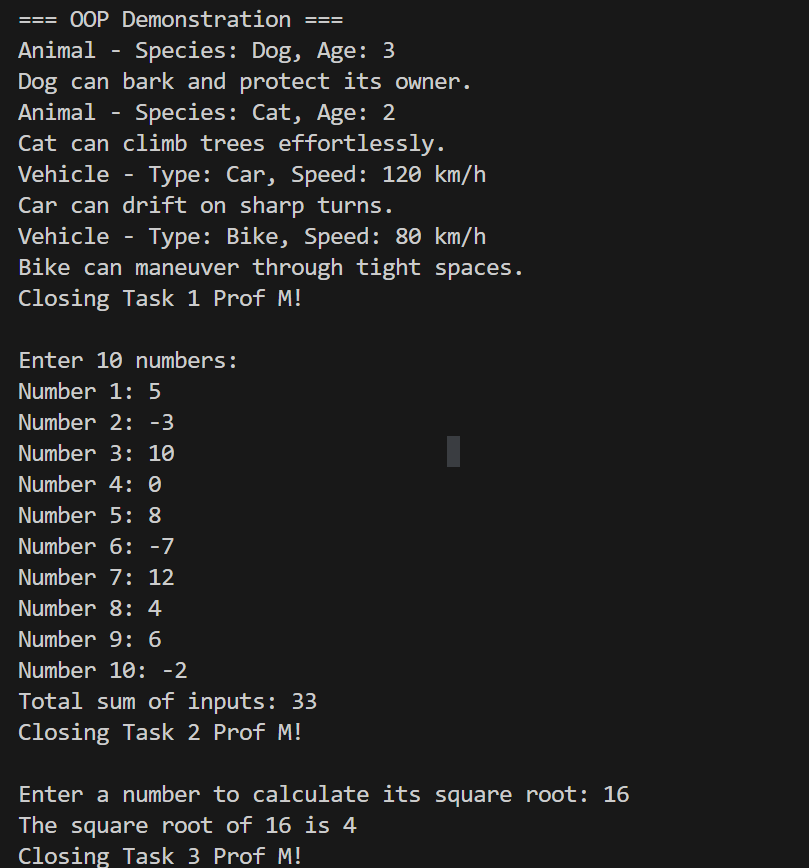

# Number game
 testing
#include <iostream>
#include <ctime>
#include <cmath> // External Library for mathematical operations
using namespace std;

// Abstract class demonstrating Abstraction
class AbstractEntity {
public:
    virtual void displayInfo() = 0; // Pure virtual function
    virtual void specialAbility() = 0; // Another pure virtual function
};

// Parent class 1 demonstrating Encapsulation & Inheritance
class Animal : public AbstractEntity {
protected:
    string species;
    int age;
public:
    Animal(string species, int age) : species(species), age(age) {}
    void displayInfo() override {
        cout << "Animal - Species: " << species << ", Age: " << age << endl;
    }
    void specialAbility() override {
        cout << species << " has a unique survival instinct." << endl;
    }
};

// Parent class 2 demonstrating Encapsulation & Inheritance
class Vehicle : public AbstractEntity {
protected:
    string type;
    int speed;
public:
    Vehicle(string type, int speed) : type(type), speed(speed) {}
    void displayInfo() override {
        cout << "Vehicle - Type: " << type << ", Speed: " << speed << " km/h" << endl;
    }
    void specialAbility() override {
        cout << type << " can accelerate rapidly." << endl;
    }
};

// Child class 1 of Animal demonstrating Polymorphism
class Dog : public Animal {
public:
    Dog(int age) : Animal("Dog", age) {}
    void specialAbility() override {
        cout << "Dog can bark and protect its owner." << endl;
    }
};

// Child class 2 of Animal demonstrating Polymorphism
class Cat : public Animal {
public:
    Cat(int age) : Animal("Cat", age) {}
    void specialAbility() override {
        cout << "Cat can climb trees effortlessly." << endl;
    }
};

// Child class 1 of Vehicle demonstrating Polymorphism
class Car : public Vehicle {
public:
    Car(int speed) : Vehicle("Car", speed) {}
    void specialAbility() override {
        cout << "Car can drift on sharp turns." << endl;
    }
};

// Child class 2 of Vehicle demonstrating Polymorphism
class Bike : public Vehicle {
public:
    Bike(int speed) : Vehicle("Bike", speed) {}
    void specialAbility() override {
        cout << "Bike can maneuver through tight spaces." << endl;
    }
};

void arrayUserInput() {
    int userInputs[10];
    int inputSum = 0;
    
    cout << "\nEnter 10 numbers: " << endl;
    for (int i = 0; i < 10; i++) {
        cout << "Number " << (i + 1) << ": ";
        cin >> userInputs[i];
        inputSum += userInputs[i];
    }
    
    cout << "Total sum of inputs: " << inputSum << endl;
    cout << "Closing Task 2 Prof M!" << endl;
}

void externalLibraryExample() {
    double number;
    cout << "\nEnter a number to calculate its square root: ";
    cin >> number;
    cout << "The square root of " << number << " is " << sqrt(number) << endl;
    cout << "Closing Task 3 Prof M!" << endl;
}

int main() {
    // Creating objects to demonstrate OOP
    Dog dog(3);
    Cat cat(2);
    Car car(120);
    Bike bike(80);

    cout << "\n=== OOP Demonstration ===" << endl;
    dog.displayInfo(); dog.specialAbility();
    cat.displayInfo(); cat.specialAbility();
    car.displayInfo(); car.specialAbility();
    bike.displayInfo(); bike.specialAbility();
    
    cout << "Closing Task 1 Prof M!" << endl;
    
    // Run array-based input system
    arrayUserInput();
    
    // Run external library function
    externalLibraryExample();
    
    return 0;
}
